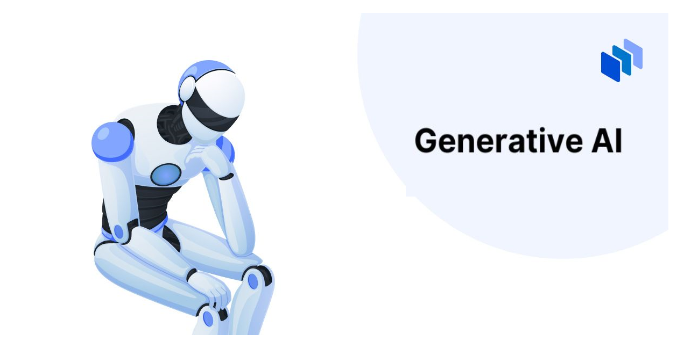
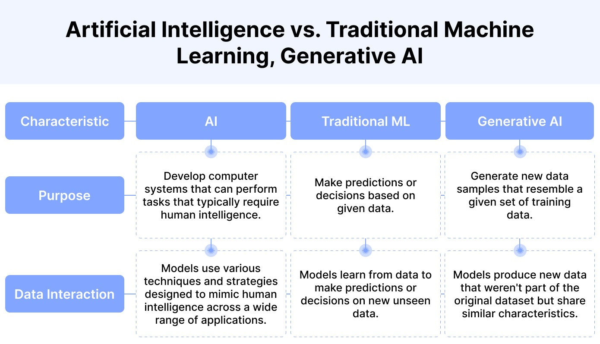

# What is Generative AI ?

## Generative AI

Generative AI is a type of Artificial Intelligence that creates new content based on what it has learned from
existing content. It can produce various types of content, including images, text, audio, and synthetic data.

Unlike traditional AI models that focus on analyzing and predicting based on existing data, Generative AI has
the ability to learn from data and automatically create new data that has never existed in the training dataset
with high quality and speed.

## How Does Generative AI Work?

Generative AI models use neural networks to learn patterns in data and generate new content. Once trained, the
neural network can generate content similar to the data it was trained on. For example, a neural network trained
on a dataset of text can generate new text, ranging from poems and stories to complex mathematical calculations
and programming code.

## Factors Influencing Generative AI Accuracy

- **Quality of Training Data**: The quality of the training data is crucial as it forms the basis for Generative AI models to learn and produce
  high-quality outputs. The more diverse and comprehensive the training data, the better the model can understand
  and replicate different patterns and nuances.

- **Model Architecture**: The architecture of the model plays a significant role in determining the capability and performance of Generative
  AI. A well-designed architecture enhances the model's ability to generate accurate and relevant content.

- **Training Process**: The training process involves fine-tuning the model's parameters to accurately reproduce the training data. This
  process requires substantial time and computational resources.

- **User Prompts**: The prompts provided by users also significantly impact the output. Clear and detailed prompts help the model generate
  more accurate and relevant results.
