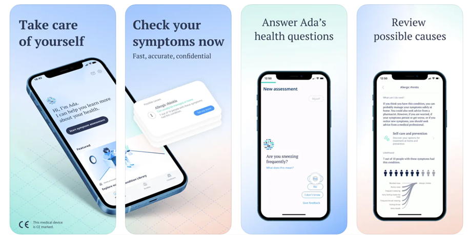

# Chatbot

Chatbots are increasingly being widely applied in many different fields, bringing many benefits to both businesses
and customers. Below are some outstanding chatbots in each field.

## Ada's Chatbot in Healthcare

In healthcare, Ada's chatbot is a vital part of their virtual healthcare platform, designed to optimize user experience
and improve the efficiency of healthcare organizations. Ada uses advanced NLP algorithms to accurately understand user
intent and context. Its Knowledge Management system stores comprehensive medical information, from symptoms and diseases
to treatments and medications. Ada continuously enhances its response and prediction capabilities through machine learning
by analyzing user interactions. With these features, Ada's chatbot is not just a customer support tool but a crucial partner
in enhancing healthcare delivery and operational efficiency.

## Edubot's Chatbot in Education

In education, Edubot is an AI chatbot developed by VergeAI specifically for higher education institutions. It is uniquely designed
for the education sector and can be easily customized to meet the needs of individual institutions, automating administrative tasks
and student services. Edubot assists prospective students during the admissions process, simplifies queries, and provides clear
guidance on tuition, financial aid, and payment procedures. Additionally, Edubot personalizes academic planning and progress based
on a student’s current credits and major.

Chatbots have proven to be essential and versatile across many fields, from healthcare to education and other industries. They are
not just automated support tools but bring significant benefits in enhancing service quality, optimizing user experience, and
improving organizational efficiency across various sectors.
