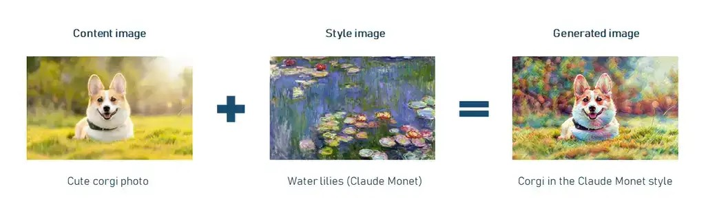
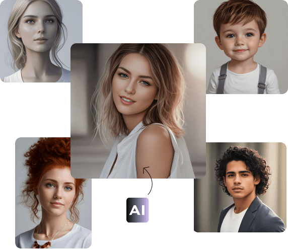
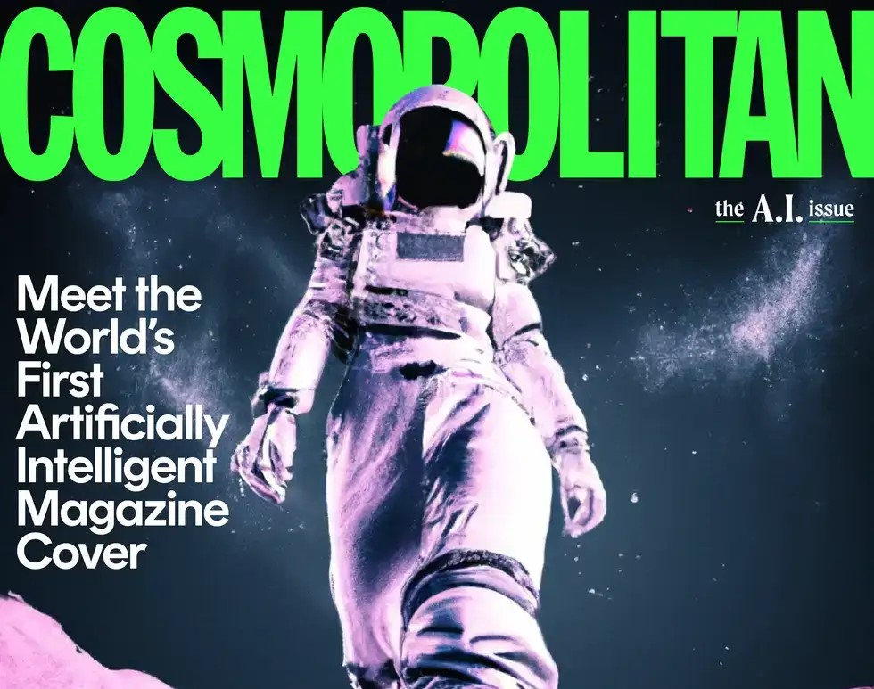
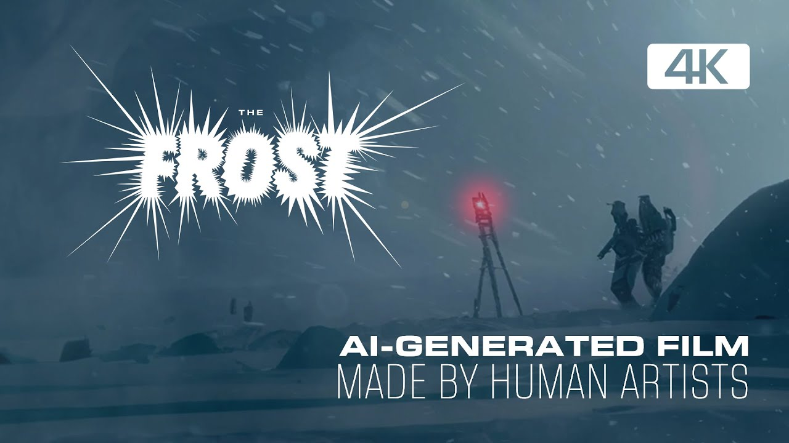
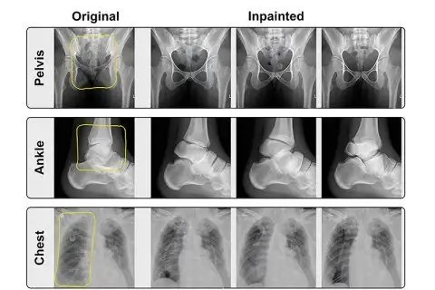

# Image Generation Models

Image generation models are a type of machine learning model capable of creating new images based on given input data.
These models, trained on vast datasets, can produce entirely new images or modify existing ones as desired.

### Achievements

- **GANs (Generative Adversarial Networks):** StyleGAN and BigGAN generate high-quality images that are nearly
  indistinguishable from real ones. They can flexibly alter image attributes such as age, gender, and hairstyle.
- **DALL-E:** OpenAI's DALL-E and DALL-E 2 create images from detailed textual descriptions, aiding fields like advertising,
  product design, and entertainment.
- **ArtBreeder & DeepArt:** blend and create new artistic images.

### Applications

- **Art and Creativity:** DALL-E and CLIP enable artists to quickly create new artworks. ArtBreeder allows combining
  different sources to generate unique images. Cosmopolitan's AI-generated cover in June 2022 demonstrated AI's potential in
  creative industries.

  

- **Entertainment:** Image generation models create realistic environments and characters for video games and films, saving time
  and resources. An example is "The Frost," a 12-minute film where AI generated every scene using DALL-E 2 and D-ID.

  

- **Marketing and Advertising:** AI-generated images accelerate campaign production, eliminating the need for product photoshoots.
  Cosmopolitan’s AI-created cover marked the first use of an AI-generated image for a major magazine cover.
- **Medicine:** Image generation models enhance diagnostic image quality. AI creates clearer, more detailed images of tissues and
  organs, aiding precise diagnosis. A study demonstrated DALL-E 2's ability to generate realistic medical images like X-rays, CT, MRI,
  and ultrasound from brief descriptions.

